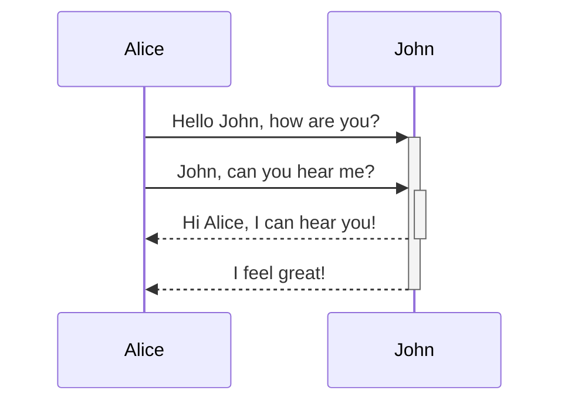

O [[Obsidian]] é um editor de markdown, mas muitas pessoas não sabem o que isso significa. Basicamente, ele processa o seu texto e formata os símbolos que você escreve. Assim como você usa `**asteriscos**` para fazer algo ficar negrito no Whatsapp ou no Discord, o Obsidian funciona do mesmo jeito!

Essa nota não inclui tudo sobre markdown, mas busca introduzir o conceito e mostrar as formatações básicas.

---

### Links

Links internos (isto é, links para outras notas do seu cofre) são feitos por meio de colchetes duplos. Exemplo: [[Obsidian]].

```md
[[Obsidian]]
```

Caso você queira fazer um link interno mas quer que ele mostre outro texto, é só separar com uma barra. O código para [[Obsidian|Outro link para o Obsidian]] seria:

```md
[[Obsidian|Outro link para o Obsidian]]
```

Um link externo - para um site, por exemplo, funciona de outro modo. Você coloca o título dentro de colchetes, e segue o link em parentêses. Exemplo: [Obsidian](http://obsidian.md).

```md
[Obsidian](http://obsidian.md)
```

Caso existam espaços nos links, você pode anular esses espaços usando `%20` ou usando os sinais de maior e menor. Por exemplo:

```md
[Exemplo](Imagem%20colada)
[Exemplo](<Imagem colada>)
```

#### Transclusões

Você pode fazer uma transclusão (*embed*) de outra nota colocando um ponto de exclamação antes dos colchetes. Por exemplo:

```md
![[Obsidian]]
```

### Cabeçalhos

Cabeçalhos servem de título, subtítulo, seções, etc. Eles são feitos com a cerquilha (ou "jogo da velha") seguida de um espaço. (Um jogo da velha sem espaço cria uma tag). Por exemplo, a palavra "Cabeçalhos" acima é um cabeçalho do nível 3 (`### Cabeçalhos`). 

Existem até seis níveis de cabeçalho:

```md
# Cabeçalho 1
## Cabeçalho 2
### Cabeçalho 3 
#### Cabeçalho 4
##### Cabeçalho 5
###### Cabeçalho 6
```

### Ênfase

*Itálico pode ser feito com um asterisco* _ou com um underline._ **Negrito pode ser feito com dois asteriscos** __ou dois underlines.__ _E você pode **combinar** os dois!_ ~~Ou ainda riscar o texto!~~

```md
*Itálico pode ser feito assim*
_Itálico também pode ser feito assim_

**Negrito pode ser feito assim**
__Negrito também pode ser feito assim__

_E você pode **combinar** os dois!_

~~Ou ainda riscar o texto!~~
```

Também é possível grifar o texto usando dois sinais de igual. ==Por exemplo==:

```
==Exemplo de texto marcado.==
```

### Listas

Listas podem ser numeradas ou não. Elas são ativadas ao colocar um hífen seguido de um espaço, ou um número seguido de um espaço (a numeração é automática): 

```md
- Item 1
- Item 2
  - Item 2a
  - Item 2b

1. Item 1
1. Item 2
1. Item 3
   1. Item 3a
   1. Item 3b
```

- Item 1
- Item 2
  - Item 2a
  - Item 2b

1. Item 1
1. Item 2
1. Item 3
   1. Item 3a
   1. Item 3b

#### Listas de tarefa

Listas de tarefa são como listas, mas seguidas de `[ ]`. Se houver um espaço entre os colchetes, o item está "a fazer", mas se houver qualquer caractere entre os espaços (geralmente é usado um `x`) ela já está "ticada".

Você pode usar as formatações de ênfase, links e tags dentro das listas de tarefa, assim como nas listas normais.

```md
- [ ] item incompleto
- [x] item completo
- [?] outro item completo
```

Alguns temas estilizam as listas de tarefa para mostrar outros tipos de itens completos. Por exemplo, o tema que usamos aqui ([[Sanctum]]) mostra o código acima como:

- [ ] item incompleto
- [x] item completo
- [?] outro item completo

### Citações

Citações (*blockquotes*) são precedidas pelo símbolo de "maior que". Por exemplo:

```md
> Exemplo de citação. Lorem ipsum dolor sit amet, consectetur adipiscing elit, sed do eiusmod tempor incididunt ut labore et dolore magna aliqua.
```

> Exemplo de citação. Lorem ipsum dolor sit amet, consectetur adipiscing elit, sed do eiusmod tempor incididunt ut labore et dolore magna aliqua.

### Código

A formatação de "código" é feita por acentos graves. Para uma formatação no meio de um parágrafo, é só colocar um acento no começo e um no fim, `assim, por exemplo`. 

Você também pode usar blocos de código (*codeblocks*) em que o texto deve três acentos no começo e três no fim. Alternativamente, você pode dar um `tab` e o texto também será tratado como código. Em blocos de código, o realce de syntaxe é ativado.  Por exemplo:

````
```js
function fancyAlert(arg) {
  if(arg) {
    $.facebox({div:'#foo'})
  }
}
```
````

```js
function fancyAlert(arg) {
  if(arg) {
    $.facebox({div:'#foo'})
  }
}
```


### Comentários

Comentários são textos que não aparecem no modo "preview". Eles funcionam usando dois sinais de porcentagem, assim: `%%`

```md
Exemplo de comentário: %%Isso não apareceria no modo preview!%%

Outro exemplo:
%%
Também dá para
ter múltiplas

linhas
%%
```

### Divisória

Você pode criar divisórias entre o conteúdo com três hífens:

```
---
```

### Imagens

Imagens podem ser tanto externas ou internas. Caso ela seja externa, você precisa usar o primeiro código e ter o link dela. Caso seja interna, isto é, se ela existir dentro do seu cofre (você pode checar se ela aparece no navegador de arquivos) ela funciona como uma transclusão de notas, como no segundo código. O título é opcional.

```


![[NOME DA IMAGEM]]
```

#### Redimensionando imagens

Exemplo da imagem acima redimensionada para ter 100 pixels horizontalmente:

```

```

---

%%
FALTA TRADUZIR O RESTO LOL

#### Obsidian URI links

[[Using obsidian URI|Obsidian URI]] links can be used to open notes in Obsidian either from another Obsidian vault or another program.

For example, you can link to a file in a vault like so (please note the [[Using obsidian URI#Encoding|required encoding]]):

```md
[Link to note](obsidian://open?path=D:%2Fpath%2Fto%2Ffile.md)
```

[Link to note](obsidian://open?path=D:%2Fpath%2Fto%2Ffile.md)

You can link to a note by its vault name and file name instead of path as well:

```md
[Link to note](obsidian://open?vault=MainVault&file=MyNote.md)
```

[Link to note](obsidian://open?vault=MainVault&file=MyNote.md)

### Tables

You can create tables by assembling a list of words and dividing them with hyphens `-` (for the first row), and then separating each column with a pipe `|`:

```md
First Header | Second Header
------------ | ------------
Content from cell 1 | Content from cell 2
Content in the first column | Content in the second column
```

First Header | Second Header
------------ | ------------
Content from cell 1 | Content from cell 2
Content in the first column | Content in the second column

---

```md
Tables can be justified with a colon | Another example with a long title
:----------------|-------------:
because of the `:` | these will be justified

If you put links in tables, they will work, but if you use Piped Links, the pipe must be escaped with a `\` to prevent it being read as a table element.
```

Tables can be justified with a colon | Another example with a long title
:----------------|-------------:
because of the `:` | these will be justified

If you put links in tables, they will work, but if you use Piped Links, the pipe must be escaped with a `\` to prevent it being read as a table element.

```md
First Header | Second Header
------------ | ------------
[[Format your notes\|Formatting]]	|  [[Keyboard shortcuts\|hotkeys]]
```

First Header | Second Header
------------ | ------------
[[Format your notes\|Formatting]]	|  [[Use hotkeys\|hotkeys]]	


### Footnotes

```md
Here's a simple footnote,[^1] and here's a longer one.[^bignote]

[^1]: meaningful!

[^bignote]: Here's one with multiple paragraphs and code.

    Indent paragraphs to include them in the footnote.

    `{ my code }`

    Add as many paragraphs as you like.
```

Here's a simple footnote,[^1] and here's a longer one.[^bignote]

[^1]: meaningful!

[^bignote]: Here's one with multiple paragraphs and code.

    Indent paragraphs to include them in the footnote.

    `{ my code }`

    Add as many paragraphs as you like.
	
```md
You can also use inline footnotes. ^[notice that the carat goes outside of the brackets on this one.]
```

You can also use inline footnotes. ^[notice that the carat goes outside of the brackets on this one.]

### Math

```md
$$\begin{vmatrix}a & b\\
c & d
\end{vmatrix}=ad-bc$$
```

$$\begin{vmatrix}a & b\\
c & d
\end{vmatrix}=ad-bc$$

You can also do inline math like $e^{2i\pi} = 1$ .

Obsidian uses [Mathjax](http://docs.mathjax.org/en/latest/basic/mathjax.html). You can check which packages are supported in Mathjax [here](http://docs.mathjax.org/en/latest/input/tex/extensions/index.html).

### Diagram

Obsidian uses [Mermaid](https://mermaid-js.github.io/) to render diagrams and charts. Mermaid also provides [a helpful live editor](https://mermaid-js.github.io/mermaid-live-editor).

<pre><code>```mermaid
sequenceDiagram
    Alice->>+John: Hello John, how are you?
    Alice->>+John: John, can you hear me?
    John-->>-Alice: Hi Alice, I can hear you!
    John-->>-Alice: I feel great!
```</code></pre>



Obsidian supports linking to notes in Mermaid:
<pre><code>```mermaid
graph TD

Biology --> Chemistry

class Biology,Chemistry internal-link;
```</code></pre>

An easier way to do it is the following: ^376b9d
<pre><code>```mermaid
graph TD

A[Biology]
B[Chemistry]

A --> B

class A,B,C,D,E,F,G,H,I,J,K,L,M,N,O,P,Q,R,S,T,U,V,W,X,Y,Z internal-link;
```</code></pre>

This way, all the note names (at least until `Z[note name]`) are all automatically assigned the class `internal-link` when you use this snippet.

If you use special characters in your note names, you need to put the note name in double quotes.
`"⨳ special character"`
It looks like this if you follow the [[Format your notes#^376b9d|second option]]:
`A["⨳ special character"]`

## Developer notes

We strive for maximum capability without breaking any existing formats, therefore we use a slightly unorthodox combination of flavors of markdown. It is broadly CommonMark, with the addition of some functionality from GitHub Flavored Markdown (GFM), some latex support, and our chosen embed syntax, which you can read more about at [[Accepted file formats]].
%%